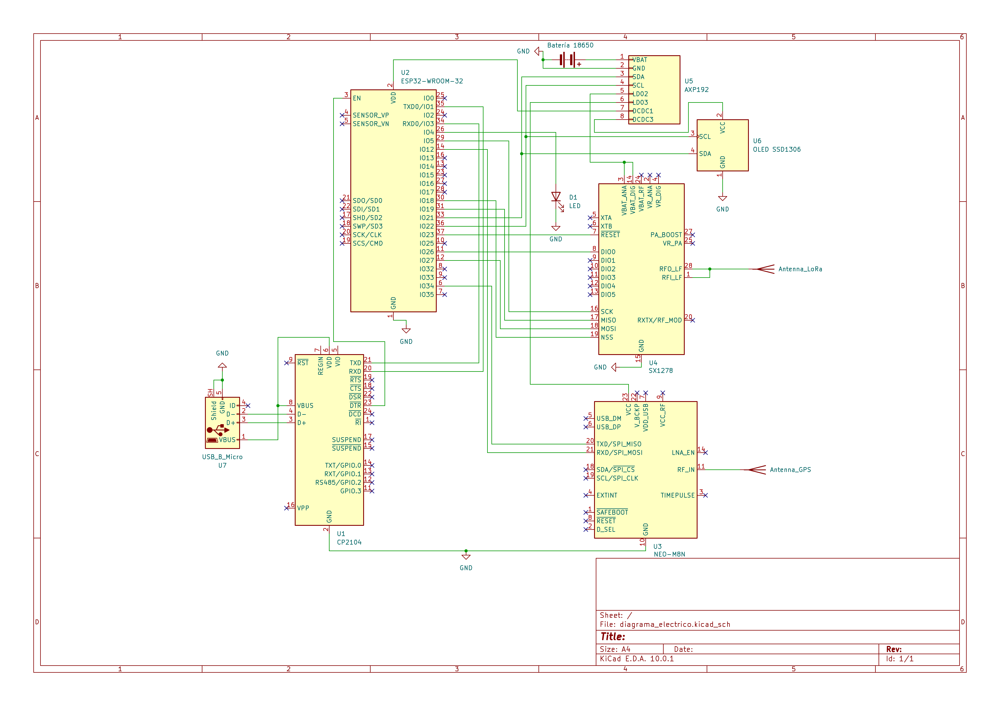

# Diagramas del sistema — Tracker LoRa-APRS

## Diagrama de bloques — Nivel 1
Vista general del sistema con entradas y salidas principales.

### Entradas:
-	Señal GPS: Señal de radiofrecuencia proveniente de los satélites GNSS, recibida por la antena GPS integrada del T-Beam.
-	Energía: Suministro de potencia proporcionado por la batería 18650 a través del gestor de energía AXP192.
-	Firmware/parámetros: Parámetros de configuración (callsign, frecuencia, intervalo TX) ingresados desde una PC vía USB durante la programación. 
### Salidas:
-	Trama LoRa RF: Paquete APRS transmitido en formato LoRa a 433.775 MHz con la posición, velocidad y rumbo del tracker.
-	Debug serial: Información de estado del sistema enviada por UART0/USB para monitoreo durante desarrollo.
-	Indicadores: LED1 indica estado de carga de batería; LED2 indica actividad del GPS.

## Diagrama de bloques — Nivel 2
Módulos internos del sistema y flujo de datos entre ellos.

### Módulo de gestión de energía:
Es un módulo pasivo respecto al flujo lógico del sistema. Su única responsabilidad es garantizar alimentación estable. No toma decisiones ni genera señales de control.
### Módulo de adquisición GPS:
Genera tramas NMEA continuamente a 1 Hz. Cada trama indica si el fix es válido (A) o no (V). El módulo de procesamiento es quien interpreta ese campo, no el GPS.
### Módulo de procesamiento:
Es el núcleo lógico del sistema. Ejecuta un bucle de lectura GPS con timeout de 60 segundos. Si obtiene fix antes del timeout, construye la trama y la envía al módulo LoRa. Al recibir TX done, o al cumplirse el timeout sin fix, ordena al control de ciclo que inicie el deep sleep.
### Módulo de transmisión LoRa:
Recibe la trama APRS, la transmite con los parámetros LoRa configurados y notifica al procesamiento cuando la transmisión concluye.
### Módulo de control de ciclo:
Al recibir la orden de sleep, configura el timer Real Time Clock (RTC) interno del ESP32 con el intervalo definido y ejecuta el deep sleep. El RTC es el único componente que permanece activo durante el reposo. Al cumplirse el tiempo, reinicia el ESP32 y el ciclo comienza nuevamente desde el procesamiento.

## Diagrama de bloques - Nivel 3
Expansión del procesamiento en el Firmware.

En este nivel se hace una ampliación del procesamiento del Firmware, donde se especifican los procesos que realiza. Esta inicia con la obtención de la trama NMEA proveniente del módulo GPS por medio de UART, donde posteriormente se realiza el parseo para obtener la información de interés, como las coordenadas y la señal de si existe "fix" o no. Esta última es la que se analiza para comprobar si se puede transmitir o no los datos obtenidos, donde si se obtiene A se dice que "hay fix", en caso de tener V en ese espacio, se dice que "no hay fix". 

Del mismo Parser se pasa el resto de información necesaria para la creación de las tramas APRS en caso de que se pueda transmitir. Una vez se tiene la trama APRS se transmite por medio de SPI al módulo de LoRa, que es el encargado de realizar la transmisión por medio de la antena a 433.775 MHz.

Todo esto se realiza respetando el control de ciclo especificado, donde más adelante por medio de la máquina de estados se puede apreciar mejor la secuencia del programa.

# Máquina de estados del Firmware

### Estados

| Estado | Descripción |
|---|---|
| **INIT** | Inicialización del sistema: UART, I²C, AXP192, GPS y LoRa. Si falla alguna inicialización, el sistema hace reboot. |
| **ESPERAR_GPS_FIX** | Lectura continua de tramas NMEA a 1 Hz. Se mantiene en este estado mientras las tramas indican sin fix (campo `V`) y el tiempo no supera los 60 segundos. |
| **CONSTRUCCION_TRAMA_APRS** | Convierte los datos GPS al formato APRS y arma el paquete completo con callsign `TI0TEC7-7`, símbolo y extensión de datos. |
| **TRANSMITIR_LoRa** | Envía el paquete APRS por RF a 433.775 MHz mediante el chip SX1276. |
| **DEEP_SLEEP** | El ESP32 apaga CPU, RAM y periféricos. Solo el RTC permanece activo contando 60 segundos. Al cumplirse, reinicia el sistema desde INIT. |

### Transiciones

| Desde | Hacia | Condición |
|---|---|---|
| Punto de entrada | INIT | Encendido o wakeup por RTC |
| INIT | ESPERAR_GPS_FIX | Inicialización exitosa |
| INIT | Punto de entrada | Error de inicialización (reinicio) |
| ESPERAR_GPS_FIX | CONSTRUCCION_TRAMA_APRS | Trama NMEA con fix válido (`A`) antes del timeout |
| ESPERAR_GPS_FIX | ESPERAR_GPS_FIX | Trama NMEA sin fix (`V`) y tiempo < 60s |
| ESPERAR_GPS_FIX | DEEP_SLEEP | Timeout 60s sin fix |
| CONSTRUCCION_TRAMA_APRS | TRANSMITIR_LoRa | Trama APRS construida |
| TRANSMITIR_LoRa | DEEP_SLEEP | TX exitoso |
| TRANSMITIR_LoRa | CONSTRUCCION_TRAMA_APRS | TX fallido (reintento) |
| DEEP_SLEEP | Punto de entrada | Wakeup por RTC (60 segundos) |

### Notas
- El GPS permanece encendido durante el deep sleep ya que el intervalo
  de 60 segundos no justifica el tiempo de reconexión que implicaría apagarlo.
- El punto de entrada (ENCENDIDO / WAKEUP RTC) no es un estado como tal, es el punto de entrada para el funcionamiento del proceso.
- El tiempo de reposo y de encendido es provicional, está sujeto a cambios según lo indiquen análisis posteriores.

# Diagrama eléctrico

### Descripción de conexiones

El sistema está compuesto por siete módulos interconectados sobre
la placa T-Beam ESP32 V1.1. El ESP32-WROOM-32 actúa como unidad
central de procesamiento y se comunica con los periféricos mediante
tres buses distintos.

**Bus SPI — Módulo LoRa SX1276**
El ESP32 se comunica con el transceptor LoRa SX1276 mediante el
bus SPI utilizando los pines GPIO5 (SCK), GPIO19 (MISO), GPIO27
(MOSI) y GPIO18 (CS). Adicionalmente, GPIO23 controla el reset del
módulo y GPIO26 recibe la interrupción DIO0 que notifica al ESP32
cuando una transmisión ha concluido. El módulo LoRa opera a
433.775 MHz con una antena de 70 cm conectada a los pines RFO_LF y RFI_LF.

**Bus UART1 — Módulo GPS NEO-M8N**
La comunicación con el módulo GPS se realiza mediante UART1 a
9600 bps. El pin GPIO34 del ESP32 recibe las tramas NMEA
transmitidas por el GPS (TX del GPS → RX del ESP32), y el pin
GPIO12 transmite comandos de configuración hacia el GPS
(TX del ESP32 → RX del GPS). La antena GPS externa se conecta
al pin RF_IN del módulo.

**Bus I²C — AXP192 PMU y pantalla OLED**
El ESP32 se comunica con el gestor de energía AXP192 y la pantalla
OLED SSD1306 mediante el bus I²C compartido en GPIO21 (SDA) y
GPIO22 (SCL). El AXP192 gestiona la alimentación de todos los
periféricos desde la batería 18650, distribuyendo 3.3V regulado
al ESP32 (DCDC1), al módulo LoRa (LDO2), al GPS (LDO3) y a la
pantalla OLED (DCDC3).

**Bus UART0 — CP2104 USB-UART**
El conversor CP2104 conecta el ESP32 con la PC mediante el puerto
Micro-USB. GPIO1 (TX0) y GPIO3 (RX0) del ESP32 se conectan a los
pines RXD y TXD del CP2104 respectivamente, permitiendo la
programación del firmware desde PlatformIO y el monitoreo de
mensajes de debug en tiempo real. La señal DTR del CP2104 está
conectada al pin EN del ESP32 para habilitar el reset automático
durante la programación.

**Alimentación**
La batería 18650 (~3.7V) alimenta al AXP192 a través del pin
VBAT. El AXP192 regula y distribuye la energía a todos los
módulos del sistema. El CP2104 se alimenta directamente del
pin VBUS del conector Micro-USB (+5V) cuando está conectado
a una PC.

### Pines utilizados

| GPIO | Función | Módulo | Bus |
|---|---|---|---|
| GPIO5 | SCK | SX1276 | SPI |
| GPIO19 | MISO | SX1276 | SPI |
| GPIO27 | MOSI | SX1276 | SPI |
| GPIO18 | CS | SX1276 | SPI |
| GPIO23 | RST | SX1276 | SPI |
| GPIO26 | DIO0 | SX1276 | SPI |
| GPIO34 | RX GPS | NEO-M8N | UART1 |
| GPIO12 | TX GPS | NEO-M8N | UART1 |
| GPIO21 | SDA | AXP192 + OLED | I²C |
| GPIO22 | SCL | AXP192 + OLED | I²C |
| GPIO1 | TX Debug | CP2104 | UART0 |
| GPIO3 | RX Debug | CP2104 | UART0 |
| GPIO4 | LED | Indicador | GPIO |
| EN | Reset | CP2104 DTR | — |

